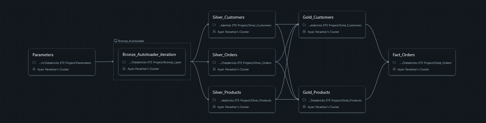

# End-to-End ETL Pipeline for E-Commerce Analytics

This repository contains the code and documentation for a complete end-to-end ETL data pipeline built on Microsoft Azure. The project processes raw e-commerce data through a **Medallion Architecture** (Bronze, Silver, Gold layers) to produce a clean, analytics-ready star schema suitable for business intelligence and reporting.

---

### End-to-End ETL Pipeline Architecture

This diagram illustrates the high-level architecture of the pipeline, showcasing the flow of data through the different layers and the key technologies used for processing, orchestration, and governance.

*(**Note:** This image should be in an `architecture` folder.)*

---

### Key Features

*   **Medallion Architecture:** The pipeline is structured into Bronze, Silver, and Gold layers to ensure data quality and progressive refinement.
*   **Complete Star Schema:** The final data model includes `DimCustomers` (SCD Type 1), `DimProducts` (SCD Type 2), and a central `FactOrders` table, creating a robust model ready for complex analytical queries.
*   **Historical Data Tracking:** The `DimProducts` table is implemented as a **Slowly Changing Dimension Type 2**, preserving the full history of product changes (e.g., name or price updates).
*   **Automated Orchestration:** The entire pipeline is orchestrated using **Databricks Jobs**, allowing for scheduled, automated runs.

---

### Technical Challenge & Solution

A key part of this project involved overcoming a real-world platform constraint.

*   **The Challenge:** The initial plan was to leverage **Delta Live Tables (DLT)** for its declarative ETL framework. However, the project was developed under an Azure subscription with strict vCPU quotas that prohibited the use of the 4-core+ virtual machines required by DLT clusters.

*   **The Solution:** I engineered a **custom, robust pipeline using standard Databricks notebooks and PySpark**. This workflow, orchestrated as a Databricks Job, fully replicates the required SCD Type 2 logic using Delta Lake's `merge` capabilities. This approach demonstrates adaptability and a deep understanding of core data engineering principles beyond framework-specific tools.

*(**Note:** This diagram visually represents the custom job that was built.)*

---

### Gold Layer Data Model (Star Schema)

The final Gold layer is modeled as a complete star schema to enable efficient analytical querying. This design features dimension tables (`DimProducts`, `DimCustomers`) joined to the central `factorders` table.

---

### Technical Stack

*   **Cloud Platform:** Microsoft Azure
*   **Data Processing:** Azure Databricks, Apache Spark (PySpark)
*   **Storage & Data Lake:** Azure Data Lake Storage (ADLS) Gen2, Delta Lake
*   **Governance:** Unity Catalog (for table management)
*   **Orchestration:** Databricks Jobs / Workflows
*   **Languages:** Python, SQL

---